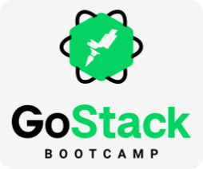

<h1 align="center">
    
</h1>

<h2 align="center">
  Bem vindo(a) ao repositório de registros das atividades realizadas durante a última edição do Bootcamp GoStack.
</h2>

  <a href="#o-que-é">O que é</a>&nbsp;&nbsp;&nbsp;|&nbsp;&nbsp;&nbsp;
  <a href="#organização-do-material">Organização do material</a>&nbsp;&nbsp;&nbsp;|&nbsp;&nbsp;&nbsp;
  <a href="#índice-dos-projetos">Índice dos projetos</a>&nbsp;&nbsp;&nbsp;|&nbsp;&nbsp;&nbsp;
  <a href="#licença">Licença</a>

---
 

### O que é
Este repositório destinasse à armazenar as atividades desenvolvidas durante as aulas da última edição do Bootcamp GoStack, após a décima edição desse Bootcamp, todas as aulas foram regravas trazendo conteúdos inéditos e atualizados, essas atualizações se sucederam até está versão do projeto GoStack, a última antes de sua substituição pelo programa Ignite.

As atividades incluídas aqui correspondem aos projetos de exemplos desenvolvidos acompanhando as video aulas, assim como aos desafios propostos após o final de cada aprendizado.

 

### Organização do material
No momento os projetos armazenados neste repositório não estão estruturados em um modelo de monorepo, esses não compartilha dependências uns com os outros, embora um projeto possa ser necessário para a execução de outro; Em um modulo ou desafio construimos uma api, em outro construimos um projeto front-end que consome a api anterior, essa situação será sempre documentada no arquivo README.md de cada projeto.

Os projetos desenvolvidos estão disponíveis dentro do diretório [packages](./packages) e recebem o nome que foi proposto na aula ou desafio. Nos arquivos README de cada projeto você encontrará uma descrição que lhe informará a origem do mesmo, também haverá instruções para à sua execução, os projetos frutos de desafios possuem um diretório chamado *_instruction*, este diretório possui uma cópia das instruções que foram fornecidas para a elaboração dos mesmos.

 

### Índice dos projetos
Abaixo estão listados os nomes de todos os projetos, uma breve descrição sobre os mesmos e um link para acessar seu local de origem.

* [schedule](./packages/schedule) Criação de uma agenda de estudos para manter o foco e o ritmo de aprendizado.
* [projects-manager:](./packages/projects-manager) Projeto Node e ReactJs que gerência uma lista de projetos.
* [repository-manager:](./packages/repository-manager) Projeto que manipula uma lista de repositórios em uma array.
* [typescript:](./packages/typescript) Projeto simples que demonstra algumas funcionalidade do typescript.
* [gobarber:](./packages/gobarber) Projeto completo backend, frontend e mobile para gerenciar uma barbearia.
* [gofinances:](./packages/gofinances) Projeto completo backend, frontend e mobile para gerenciar suas finanças.
* [gomarketplace](./packages/gomarketplace) Aplicativo mobile de marketplace para listar e incluir itens em um carrinho de comprar.
* [github-explorer:](./packages/github-explorer) Apresenta um tela com layout agradável para pesquisar repositórios do gihub e listar suas issues.
* [ecommerce-api](./packages/ecommerce-api) Api com rotas de uma aplicação de e-commerce.

 

### Licença
Esse projeto está sob licença MIT, veja o arquivo de [LICENSE](./LICENSE) para mais detalhes
