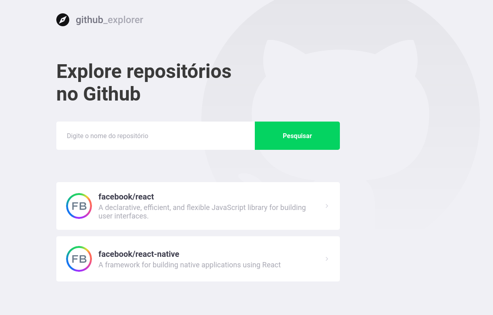
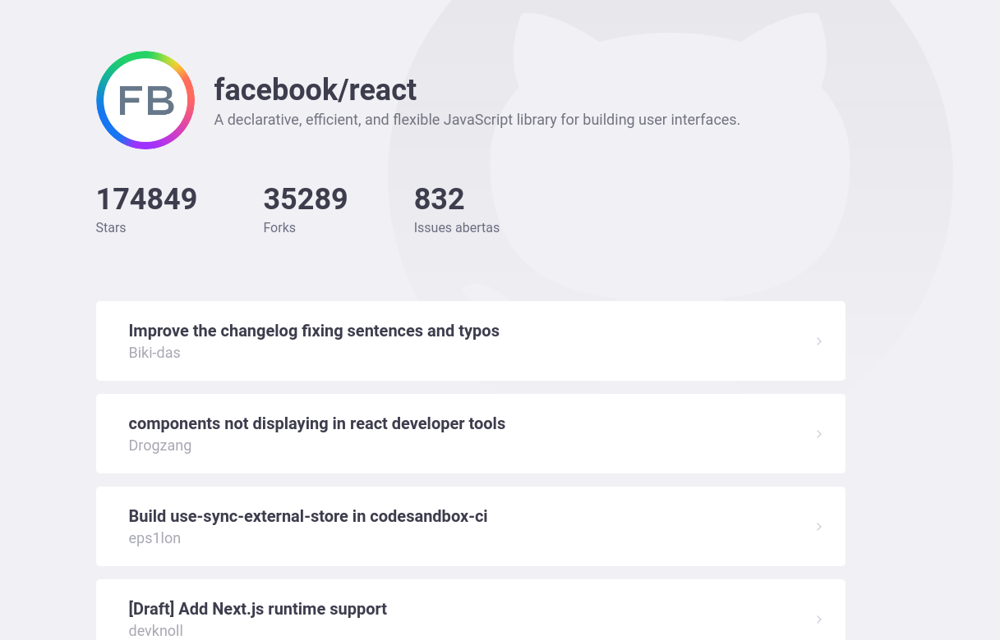

<h1 align="center">
  
</h1>

  <a href="#lista-de-correspondências">Lista de correspondências</a>&nbsp;&nbsp;&nbsp;|&nbsp;&nbsp;&nbsp;
  <a href="#sobre-o-projeto">Sobre o projeto</a>&nbsp;&nbsp;&nbsp;|&nbsp;&nbsp;&nbsp;
  <a href="#execução">Execução</a>

---
 

## Lista de correspondências
* Modulo 07: Primeiro projeto com React

## Sobre o projeto
Projeto desenvolvido com React para explorar os repositórios do github. É possível informar o caminho completo de um repositório do github, se esse repositório existir, esse será incluído na listagem de repositórios cadastrados armazenados no localStorage.

  

Após incluir um repositório, é possível clicar sobre ele para consultar seu detalhes.

## Execução
Para executar este projeto acesse o diretório do mesmo por meio do terminal e execute os comandos abaixo:
- `yarn install`
- `yarn start`
