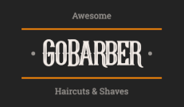
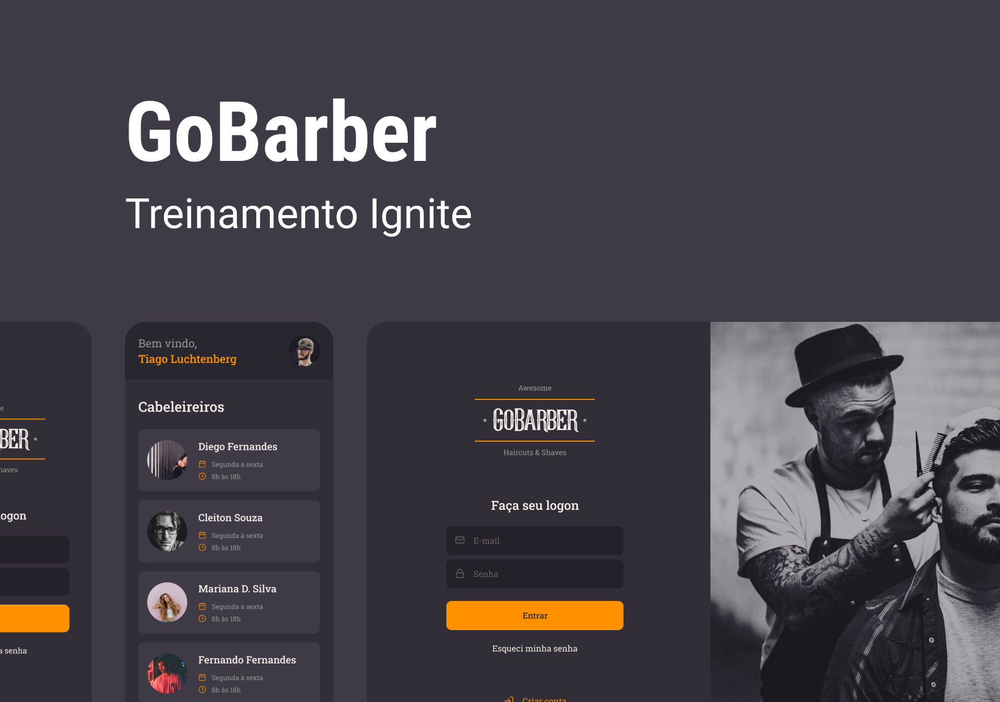

<h1 align="center">
  
</h1>

  <a href="#lista-de-correspondências">Lista de correspondências</a>&nbsp;&nbsp;&nbsp;|&nbsp;&nbsp;&nbsp;
  <a href="#sobre-o-projeto">Sobre o projeto</a>&nbsp;&nbsp;&nbsp;|&nbsp;&nbsp;&nbsp;
  <a href="#execução">Execução</a>&nbsp;&nbsp;&nbsp;|&nbsp;&nbsp;&nbsp;
  <a href="#testando-a-API">Testando a API</a>

---
 

## Lista de correspondências
* Modulo 05: Primeiro projeto com Node.JS
* Modulo 06: Iniciando back-end do app
* Modulo 08: Iniciando front-end web
* Modulo 09: Iniciando aplicativo mobile
* Modulo 10: Arquitetura e testes no NodeJs
* Modulo 11: Continuando back-end do app
* Modulo 12: Finalizando back-end do app
* Modulo 13: Finalizando front-end web do app
* Modulo 14: Finalizando front-end mobile do app

## Sobre o projeto
Este é um projeto completo, backend, frontend e mobile para gerenciar os agendamentos de uma barbearia. É possível criar uma conta de barbeiro ou cliente e utilizar a plataforma web ou mobile para consultar os clientes agendados ou agendar um corte maneiro com o seu barbeiro preferido.

Este projeto foi construido ao logo de vários módulos do Bootcamp, e seu resultado final é realmente incrível, acesse o link a seguir para ver o layout completo da aplicação [Clique aqui](https://www.figma.com/file/BXCihtXXh9p37lGsENV614/GoBarber?node-id=57%3A515)

## Execução
Para executar este projeto siga as etapas listadas abaixo

### Iniciando o backend
- Edite o arquivo [.env.example](./backend/.env.example) para o nome .env e altere as variáveis conforme desejado
- Acesse o diretório [backend](./backend) por meio do terminal
- Execute o comando `docker-compose up -d` para iniciar os bancos de dados utilizados em ambiente docker
- Execute os comandos `yarn install`para baixar as dependências do projeto
- Execute o comando `yarn typeorm migration:run`para executar as migrations no banco de dados
- Por fim execute o comando `yarn dev:server` para iniciar o servidor

Ao gerar o build do projeto, é necessário alterar o ormconfig para apontar para a pasta dist e usar o arquivo .js

### Iniciando o aplicativo web
- Edite o arquivo [.env.example](./web/.env.example) para o nome .env e altere as variáveis conforme desejado
- Acesse o diretório [web](./web) por meio do terminal
- Execute os comandos `yarn install` e `yarn start` para colocar o frontend no ar

### Iniciando o aplicativo mobile
- Abra o arquivo [api.js](./mobile/src/services/api.js) localizado em `mobile/src/services` e edite o endereço IP do parâmetro baseURL para corresponder ao endereço IP do seu computador
- Em seguida acesse o diretório [mobile](./mobile) por meio do terminal
- Execute os comandos `yarn install` e `yarn start` para baixar as dependências e executar o bundle server
- Execute o comando `yarn android` ou `yarn ios` dependendo do seu ambiente

É necessário ter um emulador de celular Android ou IOS instalado, ou um dispositivo físico com permissões de desenvolvedor ligados a maquina.

## Testando a API
Os testes para as rotas desta API podem ser realizados por meio de qualquer ferramenta que teste rotas de uma API REST. Dentro da pasta [backend/client](./backend/client) deste projeto você encontrará esquemas de requisição http que podem ser enviados diretamente por meio de sua IDE, se você estiver usando VS Code, instale a extensão *REST Client* para fazer uso deste recurso.
