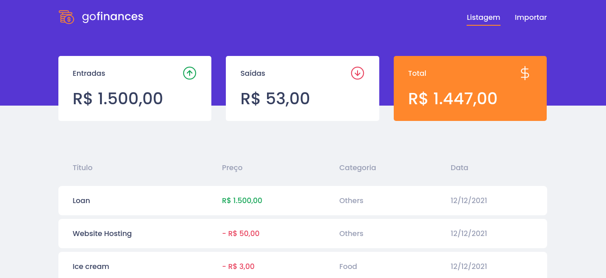

<h1 align="center">
  
</h1>

  <a href="#lista-de-correspondências">Lista de correspondências</a>&nbsp;&nbsp;&nbsp;|&nbsp;&nbsp;&nbsp;
  <a href="#sobre-o-projeto">Sobre o projeto</a>&nbsp;&nbsp;&nbsp;|&nbsp;&nbsp;&nbsp;
  <a href="#execução">Execução</a>&nbsp;&nbsp;&nbsp;|&nbsp;&nbsp;&nbsp;
  <a href="#testando-o-projeto">Testando o projeto</a>

---
 

## Lista de correspondências
* [Desafio 05: Fundamentos Node.js](./_instruction/Desafio05.md)
* [Desafio 06: Banco de dados e upload de arquivos no Node.js](./_instruction/Desafio06.md)
* [Desafio 07: GoFinances Web](./_instruction/Desafio07.md)

## Sobre o projeto
Este projeto implementa uma API e uma interface web destinada a controlar as suas finanças. O mesmo possui uma tela inicial que mostra as entradas e saídas registradas assim como um balanço do saldo atual e uma listagem detalhada dos registros cadastrados. As entradas e saídas podem ser registradas por meio da importação de um arquivo csv.

## Execução
Para iniciar o projeto siga as etapas descrita abaixo

### Iniciando o backend
- Acesse o diretório [backend](./backend) por meio do terminal
- Execute o comando `docker-compose up -d` para iniciar os bancos de dados utilizados em ambiente docker
- Execute os comandos `yarn install`para baixar as dependências do projeto
- Execute o comando `yarn typeorm migration:run`para executar as migrations no banco de dados
- Por fim execute o comando `yarn dev:server` para iniciar o servidor

### Iniciando o aplicativo web
- Acesse o diretório [web](./web) por meio do terminal
- Execute os comandos `yarn install` e `yarn start` para colocar o frontend no ar

## Testando o projeto
O projeto backend contem testes automatizados de suas rotas, para executar esses testes execute o comando `yarn test` após instalar as dependências do mesmo.

Os testes para as rotas desta API podem ser realizados manualmente por meio de qualquer ferramenta que teste rotas de uma API REST. Dentro da pasta [backend/client](./backend/client) deste projeto você encontrará esquemas de requisição http que podem ser enviados diretamente por meio de sua IDE, se você estiver usando VS Code, instale a extensão *REST Client* para fazer uso deste recurso.
