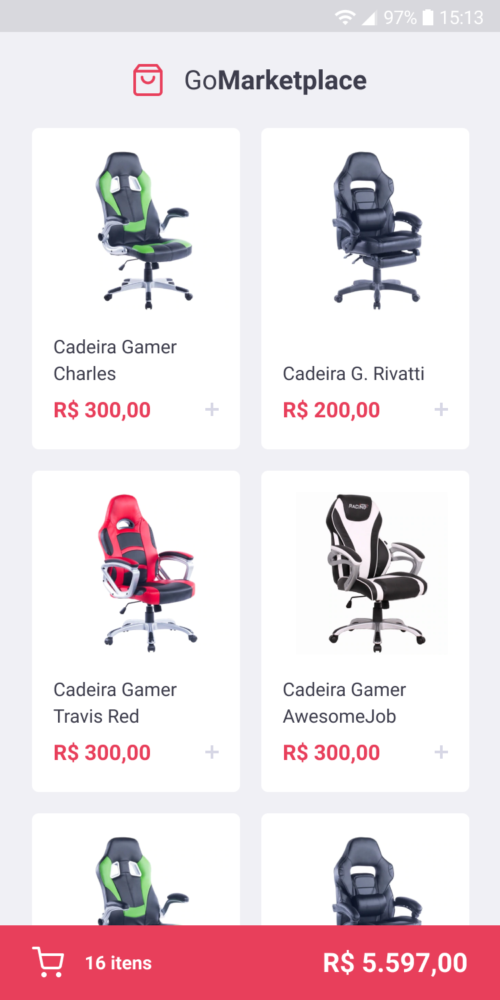
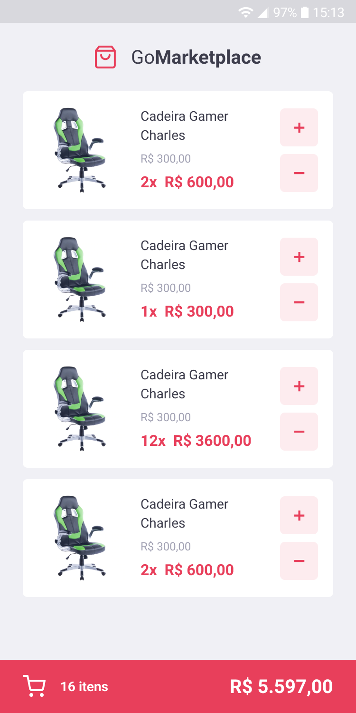

<h1 align="center">
  
</h1>

  <a href="#lista-de-correspondências">Lista de correspondências</a>&nbsp;&nbsp;&nbsp;|&nbsp;&nbsp;&nbsp;
  <a href="#sobre-o-projeto">Sobre o projeto</a>&nbsp;&nbsp;&nbsp;|&nbsp;&nbsp;&nbsp;
  <a href="#execução">Execução</a>

---
 

## Lista de correspondências
* [Desafio 08: Fundamentos do React Native](./_instruction/Desafio08.md)

## Sobre o projeto
Este projeto corresponde a um modelo simples de marketplace, nele é apresentado uma lista de produtos que podem ser incluídos em uma carrinho de compra conforme imagem abaixo.

  

O sistema com uma pela onde é possível visualizar todos os itens adicionados ao carrinho, nessa tela é possível também alterar a quantidade dos itens adicionados.

## Execução
Para executar este projeto acesse o diretório do mesmo por meio do terminal e execute os comandos abaixo:
- `yarn install`
- `yarn json-server server.json -p 3333` Este comando serve para iniciar o servidor da aplicação
- `yarn start`
- `yarn android` ou `yarn ios`

Pode ser necessário acessar o arquivo [api](./src/services/api.ts) e alterar o parâmetro baseURL para o correspondente ao seu endereço de execução do backend.

Este projeto não foi testado em dispositivos IOS.
